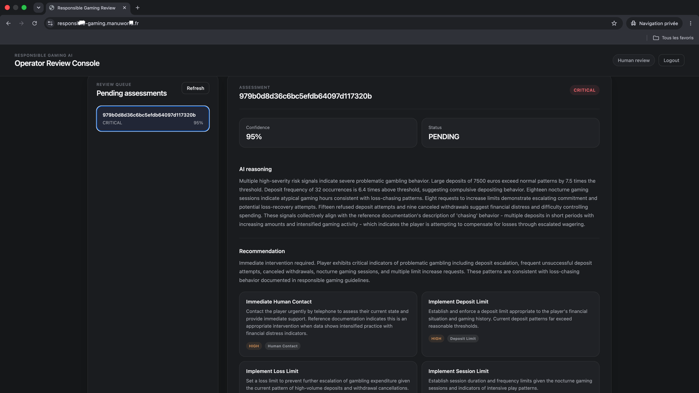
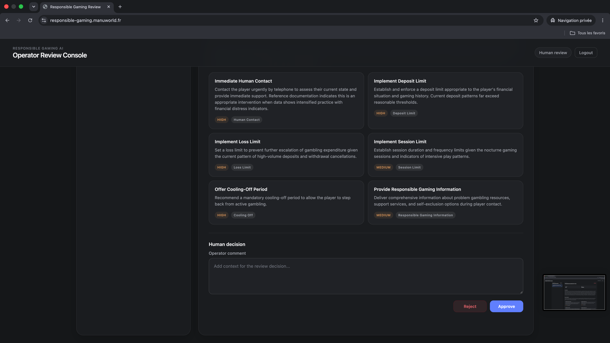

# Responsible Gaming AI

Système d'aide à la décision destiné aux équipes de jeu responsable, construit avec **Python, AWS, LangGraph et Amazon Bedrock**.

Responsible Gaming AI analyse l'activité d'un joueur, détecte des signaux de risque à l'aide de règles déterministes, récupère les procédures de jeu responsable pertinentes grâce à un système RAG, puis utilise un LLM pour produire une évaluation structurée.

Lorsqu'une situation nécessite une intervention humaine, le workflow est suspendu jusqu'à la décision d'un opérateur.

> **Ce projet portfolio utilise exclusivement des données fictives. Il ne prend aucune décision autonome concernant de vrais joueurs.**

---

## Pourquoi ce projet ?

Ce projet est directement lié à mon parcours professionnel.

Avant ma reconversion vers le développement logiciel, le cloud et l'intelligence artificielle, j'ai travaillé pendant **12 ans dans l'univers des jeux et des casinos**.

J'ai donc choisi de construire un projet autour d'un domaine que je connais, plutôt que de créer un cas d'usage IA générique.

L'objectif était de partir d'une problématique métier concrète :

> **Comment utiliser l'automatisation et l'intelligence artificielle pour assister l'analyse de comportements de jeu potentiellement à risque, sans déléguer la décision à une IA ?**

Mon expérience provient principalement de l'univers du casino physique. Le projet transpose cette connaissance du secteur vers un cas d'usage numérique de Responsible Gaming et ne prétend pas reproduire les processus internes d'un opérateur particulier.

---

## Le problème métier

Une plateforme de jeu peut générer de nombreux événements autour de l'activité d'un joueur :

- dépôts ;
- retraits ;
- sessions de jeu ;
- changements de limites ;
- tentatives de paiement ;
- activité nocturne.

Pris individuellement, ces événements ne permettent pas nécessairement de tirer une conclusion.

En revanche, certains comportements ou leur accumulation peuvent constituer des **signaux nécessitant une attention particulière**.

Par exemple :

- fréquence importante des dépôts ;
- montant de dépôts élevé ;
- sessions nocturnes répétées ;
- demandes répétées d'augmentation de limites ;
- tentatives de dépôt échouées ;
- annulations de retraits.

Le problème n'est donc pas simplement de collecter des données.

Il faut être capable de :

```text
observer l'activité
        ↓
détecter les événements pertinents
        ↓
les confronter aux procédures de jeu responsable
        ↓
contextualiser les signaux
        ↓
produire une review exploitable
        ↓
laisser un humain prendre la décision
```

C'est ce workflow que Responsible Gaming AI cherche à modéliser.

---

## Objectif de l'application

À partir d'un snapshot d'activité fictif :

```json
{
  "player_id": "DEMO-001",
  "deposit_count": 32,
  "total_deposit_amount": "7500.00",
  "session_count": 28,
  "nighttime_session_count": 18,
  "limit_increase_request_count": 8,
  "failed_deposit_attempt_count": 15,
  "cancelled_withdrawal_count": 9
}
```

le système transforme les données brutes en une review structurée :

```text
Activité joueur
      ↓
Détection déterministe
      ↓
Signaux de risque
      ↓
Contexte documentaire
      ↓
Analyse LLM
      ↓
Risk Assessment
      ↓
Validation humaine si nécessaire
```

L'application est volontairement un **système d'aide à la décision**.

Elle ne prend aucune mesure directement sur le compte d'un joueur.

---

## Pourquoi ne pas tout confier au LLM ?

Une approche simple aurait pu consister à transmettre toute l'activité du joueur à un LLM et lui demander :

> « Ce joueur présente-t-il un risque ? »

J'ai volontairement écarté cette architecture.

Une grande partie des informations analysées sont des **faits mesurables**.

Déterminer qu'un joueur a effectué un certain nombre de dépôts ou que le montant total de ses dépôts dépasse un seuil ne nécessite pas de modèle génératif.

Ces éléments sont donc détectés par du code Python déterministe.

```text
Données joueur
      ↓
Règles Python
      ↓
Signaux objectifs
```

L'IA intervient ensuite sur une responsabilité différente :

```text
Signaux détectés
       +
Procédures Responsible Gaming
       ↓
      RAG
       ↓
      LLM
       ↓
Analyse contextualisée
```

Cette séparation permet de conserver la détection des faits :

- déterministe ;
- explicable ;
- testable ;
- reproductible.

Le LLM est utilisé là où il apporte davantage de valeur : **synthétiser et contextualiser les signaux en utilisant le corpus documentaire disponible**.

---

## Pourquoi un Human-in-the-Loop ?

Détecter plusieurs signaux ne signifie pas automatiquement qu'une action doit être prise concernant un joueur.

Cette distinction est centrale dans la conception du projet.

Responsible Gaming AI ne cherche donc pas à remplacer l'opérateur.

```text
Machine
│
├── détecte
├── récupère le contexte
├── analyse
└── recommande
        │
        ▼
      Humain
        │
        ├── APPROVE
        └── REJECT
```

Lorsqu'une validation humaine est nécessaire, le workflow s'arrête réellement et attend la décision d'un opérateur.

Même après cette décision, la V1 :

- ne bloque aucun compte ;
- ne modifie aucune limite ;
- ne suspend aucun joueur ;
- n'envoie aucune communication automatiquement.

Elle finalise uniquement la review.

Cette frontière entre **analyse automatisée** et **action métier** est volontaire.

---

# Architecture

```text
Player Activity JSON
        │
        ▼
    Amazon S3
        │
        │ ObjectCreated
        ▼
    Amazon SQS ─────────────► DLQ
        │
        ▼
 Dispatcher Lambda
        │
        ▼
 AWS Step Functions
        │
        ▼
 Assessment Lambda
        │
        ▼
     LangGraph
        │
        ▼
Analyse déterministe
        │
        ├──── Aucun signal
        │          │
        │          ▼
        │   Assessment LOW
        │    déterministe
        │
        └──── Signaux détectés
                   │
                   ▼
          Bedrock Knowledge Base
                   │
                   ▼
                  RAG
                   │
                   ▼
            Amazon Bedrock
                   │
                   ▼
          Risk Assessment
                   │
                   ▼
        human_review_required?
              │           │
            false        true
              │           │
              │           ▼
              │      Human Review
              │     APPROVE / REJECT
              │           │
              │     SendTaskSuccess
              │           │
              └─────┬─────┘
                    ▼
                 Finalize
                    │
                    ▼
                DynamoDB
```

L'interface opérateur suit un flux séparé :

```text
Browser
   │
   ▼
CloudFront
   │
   ├──── Frontend statique → S3
   │
   └──── /api/*
             │
             ▼
        API Gateway
             │
             ▼
      Cognito / JWT
             │
             ▼
       Review Lambdas
             │
             ▼
          DynamoDB
```

---

## Du besoin métier à l'architecture

Les composants techniques ont été choisis à partir des responsabilités du système.

| Besoin | Choix technique |
|---|---|
| Détecter des faits objectifs | Règles Python déterministes |
| Produire une analyse contextualisée | LLM via Amazon Bedrock |
| Utiliser les procédures métier | RAG / Bedrock Knowledge Base |
| Modéliser le workflow IA | LangGraph |
| Orchestrer les composants AWS | Step Functions |
| Attendre une décision humaine | Callback / Task Token |
| Découpler l'ingestion | SQS |
| Gérer les messages en échec | DLQ |
| Conserver les reviews | DynamoDB |
| Protéger l'interface opérateur | Cognito + JWT |
| Héberger le frontend | S3 + CloudFront |
| Déployer l'infrastructure | Terraform |
| Vérifier les changements | GitHub Actions |
| Observer le système | CloudWatch + Datadog |

L'architecture ne part donc pas d'une liste de services AWS à utiliser : elle découle progressivement des contraintes du problème.

---

# Détection déterministe des risques

Le domaine contient plusieurs détecteurs indépendants.

Les signaux fictifs actuellement modélisés à des fins de démonstration sont :

| Signal | Sévérité |
|---|---|
| Montant de dépôt élevé | HIGH |
| Dépôts fréquents | MEDIUM |
| Sessions nocturnes | MEDIUM |
| Demandes d'augmentation de limite | HIGH |
| Tentatives de dépôt échouées | MEDIUM |
| Retraits annulés | MEDIUM |

Exemple simplifié :

```python
def detect(
    self,
    snapshot: PlayerActivitySnapshot,
) -> RiskSignal | None:
    if snapshot.total_deposit_amount <= self.threshold:
        return None

    return RiskSignal(
        code=RiskSignalCode.HIGH_DEPOSIT,
        severity=Severity.HIGH,
        observed_value=snapshot.total_deposit_amount,
        threshold=self.threshold,
    )
```

Ici, le rôle du LLM n'est pas de déterminer si le montant dépasse le seuil.

Python peut répondre à cette question de manière déterministe.

Le modèle intervient ensuite pour contextualiser les signaux détectés.

---

# Workflow IA avec LangGraph

LangGraph orchestre le workflow interne d'analyse :

```text
START
  │
  ▼
analyze
  │
  ├── aucun signal
  │       │
  │       ▼
  │ build_low_risk_assessment
  │       │
  │       ▼
  │      END
  │
  └── signaux détectés
          │
          ▼
   retrieve_knowledge
          │
          ▼
      build_prompt
          │
          ▼
      assess_risk
          │
          ▼
  decide_human_review
          │
          ▼
         END
```

## Le chemin LOW

Le système n'appelle pas systématiquement le LLM.

Lorsqu'aucun signal déterministe n'est détecté :

```text
Aucun signal
     ↓
Pas de RAG
     ↓
Pas de LLM
     ↓
Assessment LOW déterministe
```

Cette branche est issue d'un problème rencontré pendant les tests End-to-End.

Une première version tentait d'interroger la Bedrock Knowledge Base même lorsque la liste de signaux était vide.

La requête RAG produite était alors vide et Bedrock rejetait la requête.

Plutôt que d'introduire artificiellement une requête générique, le workflow a été modifié pour représenter explicitement ce cas métier.

Cette décision :

- évite un appel RAG inutile ;
- évite un appel LLM inutile ;
- réduit la latence ;
- réduit les coûts ;
- élimine un état invalide ;
- rend le comportement métier explicite.

---

# LangGraph et Step Functions

Le projet utilise deux orchestrateurs, mais ils répondent à des problèmes différents.

## LangGraph

LangGraph orchestre la logique interne de l'analyse IA :

```text
analyse
→ branchement
→ récupération documentaire
→ construction du prompt
→ appel LLM
→ production de l'assessment
```

Il permet de représenter explicitement l'état et les différentes branches du workflow IA.

## AWS Step Functions

Step Functions orchestre le système distribué AWS :

```text
Lambda
→ Assessment
→ Choice
→ attente humaine éventuelle
→ callback
→ reprise
→ finalisation
```

Il permet notamment au workflow d'attendre une décision humaine sans maintenir une Lambda active.

En résumé :

```text
LangGraph
→ orchestration du workflow IA

Step Functions
→ orchestration du workflow distribué AWS
```

---

# Human-in-the-Loop

Lorsqu'une review humaine est nécessaire, Step Functions utilise le pattern callback :

```text
lambda:invoke.waitForTaskToken
```

Le workflow génère un Task Token puis appelle la Lambda chargée de créer la review.

```text
Step Functions
      │
      ▼
WaitForHumanReview
      │
      ▼
Review Request Lambda
      │
      ▼
DynamoDB
review_status = PENDING
      │
      ▼
Step Functions reste RUNNING
```

L'opérateur peut ensuite consulter l'assessment depuis l'interface.

```text
Operator
    │
    ├── APPROVE
    │
    └── REJECT
           │
           ▼
      API Gateway
           │
           ▼
 Review Decision Lambda
           │
           ▼
      DynamoDB
           │
           ▼
   SendTaskSuccess
           │
           ▼
 même exécution Step Functions
           │
           ▼
        Finalize
```

Le Task Token n'est jamais exposé au navigateur.

L'interface manipule l'identifiant de l'assessment tandis que le backend conserve la capacité technique permettant de reprendre l'exécution Step Functions.

---

# Interface opérateur

Le frontend est volontairement simple et développé en :

- HTML ;
- CSS ;
- JavaScript vanilla.

Son objectif n'est pas de constituer une application frontend complexe, mais de rendre le workflow backend réellement utilisable.

L'opérateur peut consulter une assessment en attente avec :

- le niveau de risque ;
- le niveau de confiance ;
- le statut de la review ;
- le raisonnement produit par l'analyse IA ;
- les recommandations proposées.



Les recommandations restent des propositions.

Elles ne sont pas automatiquement appliquées au compte du joueur.

L'opérateur peut ajouter du contexte à sa décision puis **approuver ou rejeter** la review.



Le frontend permet ainsi de matérialiser la frontière entre l'analyse automatisée et la décision humaine.

Il est distribué via :

```text
Amazon S3 privé
      ↓
Amazon CloudFront
      ↓
HTTPS
```

---

# Gestion de la concurrence

La validation humaine a introduit un problème de concurrence intéressant.

Une première implémentation effectuait :

```text
GetItem
   ↓
vérifier PENDING
   ↓
UpdateItem
```

Deux requêtes concurrentes pouvaient donc toutes les deux lire `PENDING` avant que la première ne modifie la donnée.

Le problème a été reproduit lors d'un test End-to-End avec plusieurs décisions concurrentes sur le même assessment.

La transition est maintenant protégée par une **conditional write DynamoDB** :

```text
PENDING
   │
   │ ConditionExpression
   ▼
APPROVED / REJECTED
```

Lors du test de concurrence après correction :

```text
3 décisions concurrentes

1 décision → acceptée
2 décisions → 409 Conflict
```

Une seule requête peut donc effectuer la transition depuis `PENDING`.

Ce mécanisme constitue une forme d'**optimistic concurrency control**.

---

# Sécurité

La sécurité a été intégrée comme une responsabilité du système et non ajoutée uniquement à la fin du projet.

## Authentification opérateur

L'interface utilise Amazon Cognito avec :

```text
OAuth 2.0
+
Authorization Code
+
PKCE
```

Aucun client secret n'est stocké dans le navigateur.

Les routes API sont protégées par un JWT Authorizer API Gateway.

Un appel sans JWT valide retourne :

```text
HTTP 401 Unauthorized
```

## Protection du workflow

Le Task Token Step Functions n'est jamais envoyé au frontend.

Le navigateur ne dispose pas non plus de credentials AWS.

```text
Browser
   ↓
API Gateway
   ↓
JWT validation
   ↓
Backend
   ↓
AWS services
```

## IAM

Les responsabilités disposent de rôles distincts :

- Dispatcher ;
- Assessment ;
- Review Request ;
- Review Decision ;
- Review List ;
- Step Functions.

Les permissions IAM sont limitées aux opérations nécessaires autant que possible.

---

# Tests

Les tests automatisés couvrent notamment :

- les entités du domaine ;
- les règles déterministes ;
- le workflow LangGraph ;
- le chemin sans signal ;
- la création d'une review ;
- les décisions humaines ;
- les handlers Lambda ;
- la protection contre les décisions concurrentes.

Les commandes principales sont :

```bash
uv run ruff check .
uv run ruff format --check .
uv run --no-editable pytest
```

Des tests End-to-End ont également été réalisés sur l'infrastructure AWS réellement déployée.

Scénarios principaux validés :

```text
CRITICAL
   ↓
Human Review
   ↓
APPROVE
   ↓
Callback
   ↓
Finalize
```

```text
CRITICAL
   ↓
Human Review
   ↓
REJECT
   ↓
Callback
   ↓
Finalize
```

```text
NO SIGNAL
   ↓
LOW
   ↓
Finalize
```

Un scénario de concurrence a également été exécuté afin de vérifier qu'une seule décision pouvait finaliser une review `PENDING`.

---

# Intégration continue

GitHub Actions exécute automatiquement les contrôles qualité lors des pushes et Pull Requests vers `main`.

```text
Push / Pull Request
        │
        ├──────────────┐
        ▼              ▼
 Python Quality   Terraform Quality
        │              │
   uv sync        terraform fmt
        │              │
   Ruff lint      terraform init
        │              │
 Ruff format      terraform validate
        │
      pytest
```

La CI utilise un runner Linux propre.

Cela permet notamment de détecter les dépendances implicites à l'environnement de développement local.

## Un bug réellement détecté par la CI

Lors du premier passage de la CI, les tests échouaient avant même leur exécution.

Un client boto3 Step Functions était créé lors de l'import du module :

```python
step_functions_client = boto3.client("stepfunctions")
```

Mon environnement local possédait déjà une région AWS configurée, ce qui masquait le problème.

Le runner GitHub Actions n'en possédait pas.

Le problème a été corrigé avec une initialisation lazy du client :

```python
def _get_step_functions_client() -> BaseClient:
    global step_functions_client

    if step_functions_client is None:
        step_functions_client = boto3.client("stepfunctions")

    return step_functions_client
```

Cette correction évite un side effect lors de l'import tout en conservant la possibilité de réutiliser le client lors des warm invocations Lambda.

La CI n'est donc pas uniquement présente pour afficher un statut vert : elle a permis d'identifier une dépendance réelle à mon environnement local.

---

# Observabilité

L'infrastructure AWS est connectée à Datadog via l'intégration AWS.

L'objectif est de pouvoir répondre rapidement à des questions opérationnelles comme :

```text
Le système reçoit-il des événements ?

Les Lambda échouent-elles ?

Les workflows Step Functions démarrent-ils ?

L'API répond-elle correctement ?

La latence augmente-t-elle ?
```

Le dashboard suit notamment :

## Lambda

- invocations par fonction ;
- erreurs ;
- durée d'exécution.

## Step Functions

- exécutions démarrées ;
- exécutions échouées.

## API Gateway

- nombre de requêtes ;
- latence ;
- erreurs 4XX ;
- erreurs 5XX.

Les erreurs 4XX et 5XX sont volontairement séparées.

Un `401 Unauthorized` peut par exemple représenter le fonctionnement attendu de la couche de sécurité, tandis qu'une augmentation des erreurs 5XX est davantage susceptible d'indiquer un problème backend ou infrastructure.

---

# Stack technique

## Backend

- Python 3.13
- Pydantic
- LangGraph
- boto3

## Intelligence artificielle

- Amazon Bedrock
- Anthropic Claude
- Amazon Bedrock Knowledge Bases
- RAG

## AWS

- Amazon S3
- Amazon SQS
- Dead-Letter Queue
- AWS Lambda
- AWS Step Functions
- Amazon DynamoDB
- Amazon API Gateway
- Amazon Cognito
- Amazon CloudFront
- Amazon Route 53
- AWS Certificate Manager

## Infrastructure et qualité

- Terraform
- uv
- Ruff
- pytest
- pre-commit
- GitHub Actions

## Observabilité

- Amazon CloudWatch
- Datadog

## Frontend

- HTML
- CSS
- JavaScript

---

# Structure du repository

```text
responsible-gaming-ai/
├── .github/
│   └── workflows/
├── docs/
│   ├── adr/
│   ├── contracts/
│   └── image/
├── edge/
├── frontend/
├── infra/
│   ├── environments/
│   └── modules/
├── scripts/
├── src/
│   └── responsible_gaming/
│       ├── application/
│       ├── domain/
│       ├── infrastructure/
│       └── interfaces/
├── tests/
├── pyproject.toml
└── README.md
```

Le code cherche à conserver une séparation claire entre les responsabilités :

```text
Domain
   ↑
Application
   ↑
Infrastructure / Interfaces
```

Le domaine contient les règles métier et ne dépend pas directement des services AWS.

Les détails techniques externes sont placés derrière les frontières applicatives lorsque cela apporte une séparation utile, sans chercher à sur-architecturer chaque composant.

---

# Limites connues

Cette version est volontairement une **V1**.

Certaines limites sont connues et assumées.

## Cohérence distribuée entre DynamoDB et Step Functions

La décision humaine nécessite actuellement deux opérations sur des systèmes distincts :

```text
Conditional Update DynamoDB
        ↓
SendTaskSuccess
        ↓
Step Functions
```

Ces opérations ne partagent pas de transaction ACID.

Il existe donc une fenêtre dans laquelle :

1. la décision peut être enregistrée dans DynamoDB ;
2. l'appel `SendTaskSuccess` peut rencontrer une erreur réseau ;
3. Step Functions peut rester en attente.

Une simple restauration de l'état `PENDING` ne serait pas nécessairement correcte : une erreur réseau ne garantit pas que Step Functions n'a pas reçu le callback.

Une architecture destinée à la production pourrait introduire :

- un état intermédiaire ;
- une stratégie d'idempotence ;
- un mécanisme de retry ;
- un worker de réconciliation ;
- un pattern outbox selon les contraintes métier.

Cette complexité a volontairement été laissée hors du périmètre de la V1.

## Exécution des recommandations

Le système s'arrête après la review humaine.

Il ne :

- bloque pas un compte ;
- ne modifie pas les limites ;
- ne suspend pas un joueur ;
- n'envoie pas automatiquement de communication.

Une future version pourrait introduire des ports/adapters vers des systèmes métier capables d'exécuter certaines actions après validation humaine.

Le LLM ne devrait cependant jamais disposer directement des permissions permettant de modifier un compte joueur.

## Infrastructure

Cette V1 utilise un état Terraform local.

Ce choix reste acceptable pour un projet individuel, mais une infrastructure utilisée par une équipe nécessiterait notamment un backend distant et un mécanisme de locking.

Le projet possède une CI mais pas de déploiement continu automatique vers AWS.

---

# Évolutions possibles

Une V2 pourrait notamment introduire :

- actions métier contrôlées après validation humaine ;
- règles de risque configurables ;
- protocole HITL plus robuste ;
- audit trail enrichi ;
- timestamps métier ;
- réconciliation automatique des workflows ;
- métriques métier personnalisées ;
- tracing distribué ;
- environnements dev / staging / production ;
- backend Terraform distant ;
- déploiement AWS via GitHub OIDC ;
- enrichissement du corpus RAG.

Une règle architecturale resterait néanmoins centrale :

> **Le LLM peut proposer et contextualiser. Les actions sensibles doivent rester contrôlées par des composants déterministes et des mécanismes d'autorisation explicites.**

---

# Ce que ce projet m'a permis de travailler

Responsible Gaming AI se situe à l'intersection de mon expérience professionnelle dans l'univers des jeux et de ma reconversion vers l'ingénierie logicielle, le cloud et l'intelligence artificielle.

Le projet m'a permis de travailler concrètement sur :

- modélisation d'un problème métier ;
- architecture backend ;
- séparation des responsabilités ;
- architecture orientée domaine ;
- systèmes distribués ;
- serverless AWS ;
- Infrastructure as Code ;
- orchestration avec Step Functions ;
- workflows IA avec LangGraph ;
- RAG ;
- intégration LLM ;
- Human-in-the-Loop ;
- concurrence ;
- sécurité ;
- tests unitaires ;
- tests End-to-End ;
- CI ;
- observabilité.

L'objectif n'était pas simplement de connecter un LLM à une API.

L'objectif était de construire un système dans lequel **l'intelligence artificielle possède une responsabilité clairement délimitée au sein d'une architecture logicielle plus large**, tout en partant d'un domaine métier lié à mon expérience professionnelle.

---

# Avertissement

Toutes les données joueur présentes dans ce repository sont fictives et destinées exclusivement à la démonstration technique.

Les règles, seuils, niveaux de risque et recommandations présents dans le projet ont été conçus à des fins pédagogiques et ne représentent pas les procédures d'un opérateur de jeu réel.

Ce projet n'est pas destiné à être utilisé tel quel pour prendre des décisions concernant de vrais joueurs.
